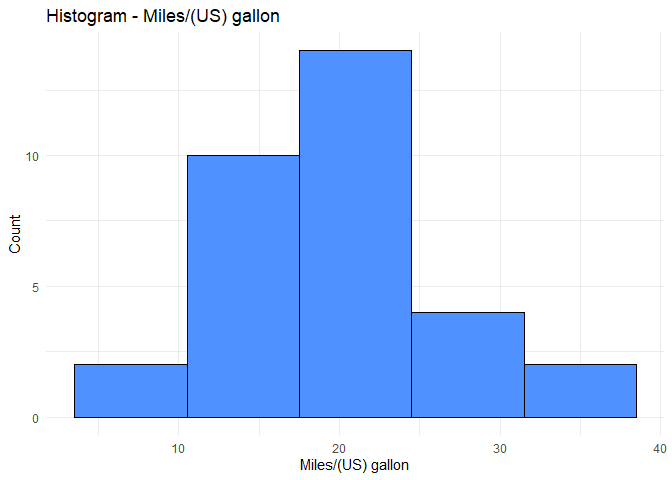
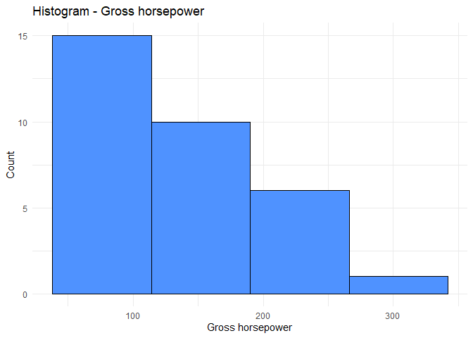
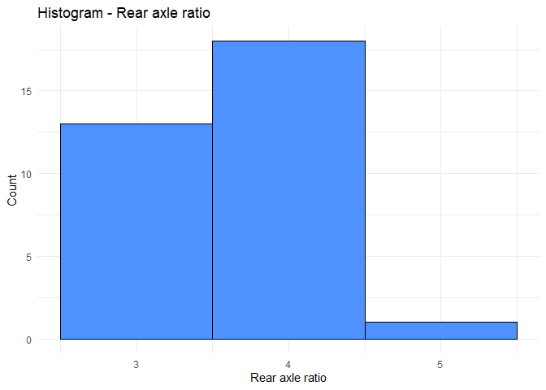
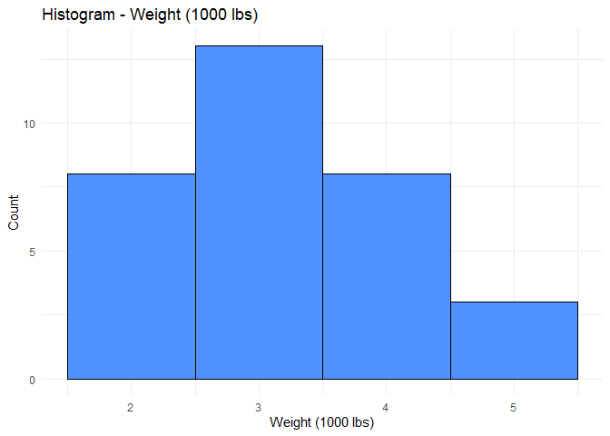
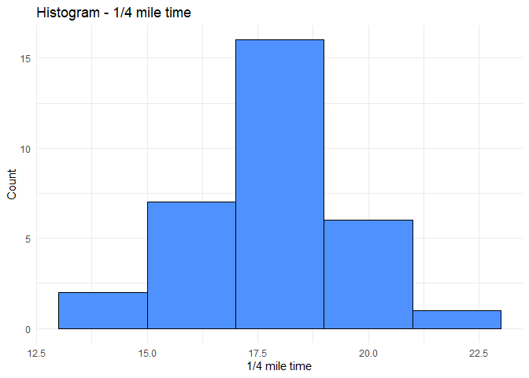

Single Variable Histogram in R
================

# Load packages

``` r
library(ggplot2)
library(dplyr)
library(stringr)
library(table1)
```

# Define generate\_histogram function

``` r
generate_histogram = function(data,
                              quantitative_variable,
                              readable_variable_label, 
                              fill_color = "#4f92ff") {
     # Use Scott method to get number of bins
     max_value = max(data[[quantitative_variable]], na.rm = TRUE)
     min_value = min(data[[quantitative_variable]], na.rm = TRUE)
     sd_value = sd(data[[quantitative_variable]], na.rm = TRUE)
     obs_count = nrow(data)
     scott_number_bins_numer = (max_value - min_value) * obs_count ^ (1/3)
     scott_number_bins_denom = 3.5 * sd_value
     scott_number_bins = scott_number_bins_numer / scott_number_bins_denom
     scott_number_bins = round(scott_number_bins, 0)
     
     # Use Scott method to get bin width
     scott_bin_width_numer = 3.5 * sd_value
     scott_bin_width_denom = obs_count ^ (1/3)
     scott_bin_width = scott_bin_width_numer / scott_bin_width_denom
     scott_bin_width = ifelse(scott_bin_width < 1,
                              1,
                              round(scott_bin_width, 0))
     
     # Generate title for plot
     title_for_plot = paste("Histogram -", readable_variable_label)
     title_for_plot = str_wrap(title_for_plot, width = 60)
     
     # Draw plot
     p = ggplot(data, aes(x = data[[quantitative_variable]])) + 
          geom_histogram(color = "black",
                         fill = fill_color,
                         bins = scott_number_bins,
                         binwidth = scott_bin_width) +
          labs(title = title_for_plot,
               y = "Count",
               x = readable_variable_label) + 
          theme_minimal()
     return(p)
}
```

# Set list of quantiative variables

``` r
quantVars = c(
     "mpg",
     "disp",
     "hp",
     "drat",
     "wt",
     "qsec"
)
```

# Set readable labels for quantitative variables (optional, but highly recommended)

``` r
label(mtcars$mpg) = "Miles/(US) gallon"
label(mtcars$disp) = "Displacement (cu.in.)"
label(mtcars$hp) = "Gross horsepower"
label(mtcars$drat) = "Rear axle ratio"
label(mtcars$wt) = "Weight (1000 lbs)"
label(mtcars$qsec) = "1/4 mile time"
```

# Generate histogram for each quantitative variable

``` r
for (variable in quantVars) {
     p = generate_histogram(data = mtcars,
                            quantitative_variable = variable,
                            readable_variable_label = label(mtcars[[variable]]))
     plot(p)
}
```

<!-- --><!-- --><!-- --><!-- --><!-- --><!-- -->
